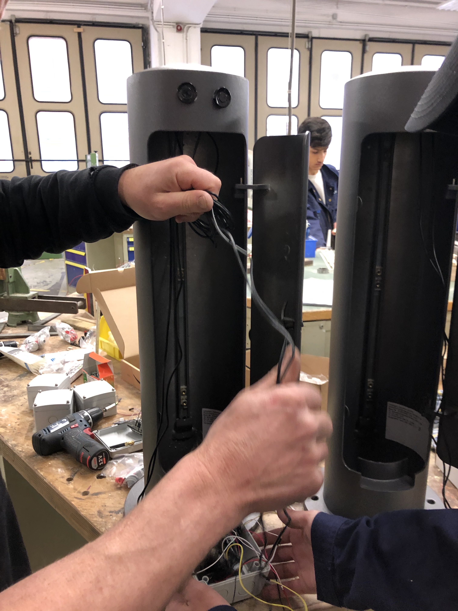

# Peoplecounter 

This repository provides hardware specifications and software to get an ultrasonic based people counter run with the following features
1. Differentiation between incoming and outcoming people
2. Sending data to TTN Network
3. Based on ultasonic to avoid personal data tracking
4. Connection to Berlin IoT Data Hub

## Requirements to use the code
1. PlatformIO integration with visual studio code
2. Account at Thethingsnetwork

 
